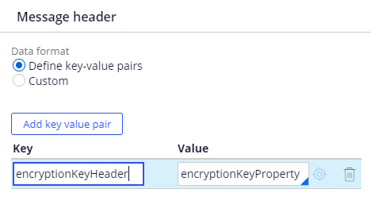

## Kafka message custom processing
Custom processing allows users to apply their own modification to Kafka message while it's in 
serialized form - just before deserialization when PRPC Platform reads message or right after 
serialization when PRPC Platform sends message. Example of such processing could be message 
encryption and decryption. 

## How to configure custom processing
In Kafka data set rule form, in section `Message values` check `Enable custom value processing`. In field 
`Java class with reader implementation` enter name of class you want to use in browse operation for pre-processing
and in field  `Java class with writer implementation` enter class name for post-processing in save operation.

If any header values are to be used in custom processing, they must mapped to properties in `Message headers` section.
For example below configuration of key value pairs allows to use `encryptionKeyHeader` in custom processor.
It can be retrieved from ClipboardPage passed in argument using expression `headersPage.getString("encryptionKeyProperty")`

If custom header format is used, only values serialized in `Pega-Custom` header are available for custom processor.

## How custom processing works
User specifies in Kafka data set configuration, which classes should be used for pre-processing in browse operation
and post-processing in save operation. These classes are instances of BiFunction interface, which take
byte array and ClipboardPage as arguments and return byte array value. Kafka data set invokes custom processor
in browse and save operation

##### Browse operation
- Kafka message is read
- Data set reads headers (if header processing is configured) and creates
  a ClipboardPage containing only values read from headers
- Custom processor specified in `Java class with reader implementation` is invoked. Serialized message 
(as byte array) and deserialized message headers (as ClipboardPage) are passed as argument
- Custom processor modifies the message 
- Kafka data set deserializes modified message to a ClipboardPage  

##### Save operation
- Message is serialized
- Kafka data set invokes custom processor specified in field `Java class with writer implementation`
Passes serialized message (as byte array) and ClipboardPage containing all record properties that are mapped to a header.
- Custom processor modifies the message
- Modified message is sent to Kafka

##### Custom processing class parameters specification 
Order|Class|Type|Description
-----|----|-----|-----------
1|byte[]|First argument of `apply` method|Serialized message before custom processing
2|ClipboardPage|Second argument of `apply` method|Clipboard page containing all properties mapped to headers
3|byte[]|Return value of `apply` method|Message modified by custom processor  

## Sample encryption and decryption
This sample demonstrates how Kafka message encryption can be implemented using custom processing.
Sample encryption is a Ceasar's cipher, which adds fixed number to each byte in serialized message.
This number is an encryption key and must be provided in Kafka message header and mapped to PRPC property
"encryptionKey" in Kafka data set configuration.

## Implementing custom processors 
Implementation of custom processing consists of two classes - one for pre-processor and one for post-processor.
Both classes must fulfill following requirements:
- implement `BiFunction<byte[], ClipboardPage, byte[]>` interface
- processing must be implemented in `apply` method
- class must be public
- must contain public constructor without arguments
- processing should not keep any state in class instance fields

## Supported platform versions
Kafka message custom processing is supported since version 8.6

## Building from source
In order to build the sample from source, you need to have access to **coreBuildDistributionImage** and have **Gradle 4.8** or higher.
1. Extract **coreBuildDistributionImage.zip/archives/pegadbinstall-classes.zip** to a temporary folder
2. Copy jar file to the **libs** folder:
 - pegadbinstall-classes/lib/pega/prpublic.jar → libs/prpublic.jar
3. Run `./gradlew build -x test` to generate **build/libs/kafka-encryptor-decryptor-sample-1.0-SNAPSHOT.jar** component jar, which can be installed as a component

## Running tests
1. Copy jar files to the **libs** folder:
 - pegadbinstall-classes/lib/pega/prpublic.jar → libs/prpublic.jar
 - pegadbinstall-classes/lib/pega/pricu2jdk.jar → libs/pricu2jdk.jar
2. Run `./gradlew test`

