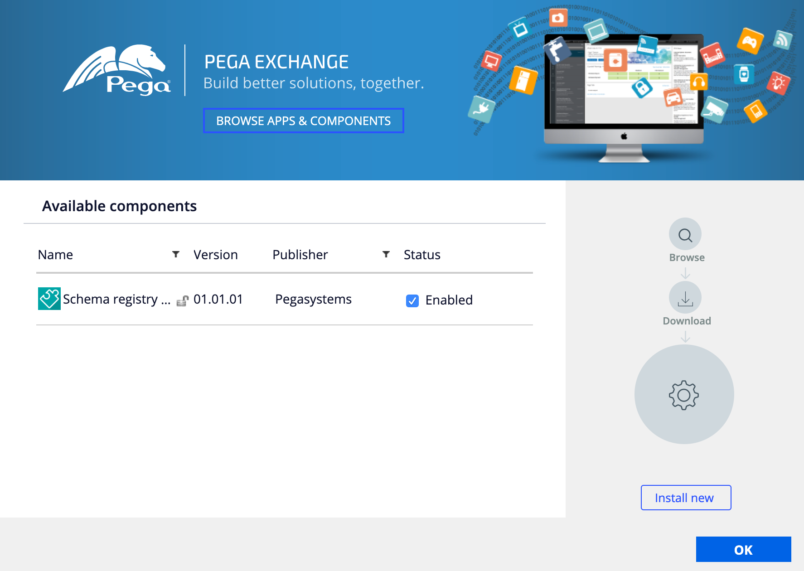
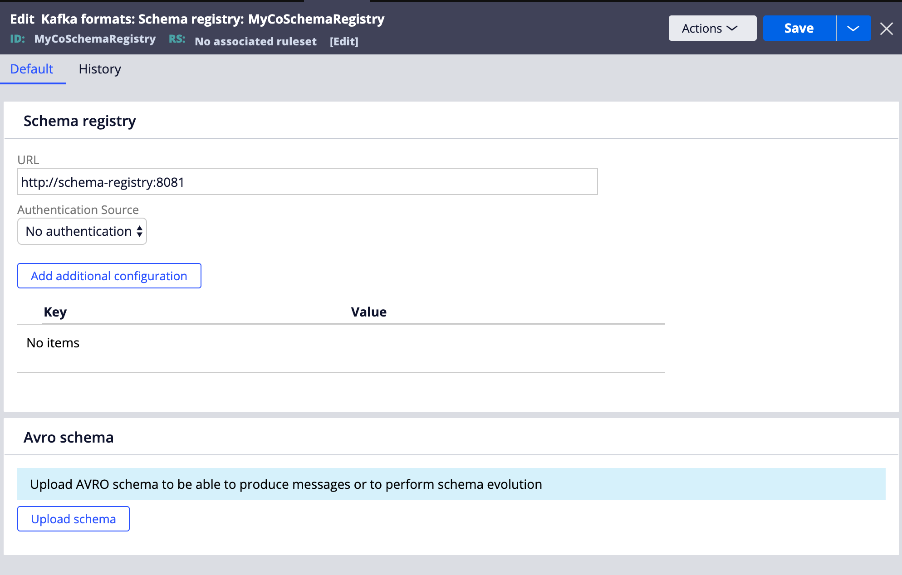
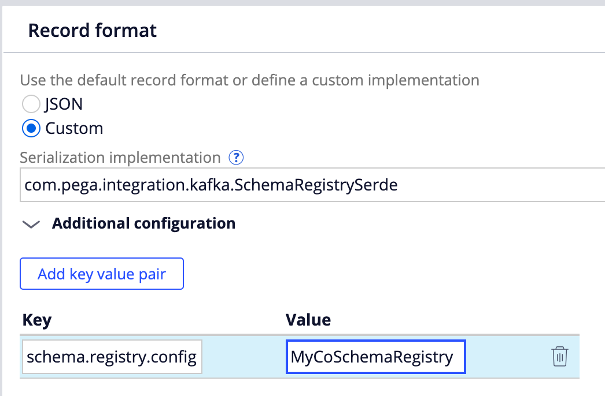

# Avro and Schema registry support

### Description

Avro and Schema registry component integrates Pega platform with [Confluent Schema Registry](https://docs.confluent.io/current/schema-registry/index.html) and extends the out-of-the-box Kafka data set to support messages in [Avro format](https://avro.apache.org/).

Main features:

- Data record to configure connection with a schema registry
- Custom Kafka data set SerDe to read messages in Avro format with an option to perform schema evolution
- Custom Kafka data set SerDe to write messages in Avro format

### Install component

1. Open your application definition and navigate to "Enabled components" section
2. Press "Manage components" button, the Pega exchange dialog will open.
3. Press "Install new" button and upload the component package (if it fails on the first attempt, try one more time)

4. Press "OK" and save your application.
5. **Important!** Restart your application server to finish the installation.

### Configure schema registry
1. Create schema registry configuration New → SysAdmin → Kafka formats: Schema registry
2. Give it a meaningfull name, e.g. MyCoSchemaRegistry
3. Fill the rule form and save the data instance

Avro schema section is optional and required only to produce messages or perform schema evolution.

Additional configuration section allows to configure [extra options supported by the Confluent schema registry client](https://docs.confluent.io/current/schema-registry/connect.html#configuration-options)

### Configure Kafka data set
1. Create Kafka data set and fill necessary details in
2. Navigate to "Record format" and select "Custom"
3. In the "Serialization implementation" field fill `com.pega.integration.kafka.AvroSchemaRegistrySerde`
4. Press "Add key value pair" to add additional configuration
5. Add `schema.registry.config=MyCoSchemaRegistry` configuration referring to the previously created schema registry data instance

6. Save the data set

### Limitations and known issues
Changes to Kafka data set are not taken in account after it has been used. That means that the following scenario may not work:
1. Configure Kafka data set to use MyCoSchemaRegistry
2. Use the data set to read messages from a Kafka topic
3. Update MyCoSchemaRegistry to use a different schema registry URL or additional configurations
Because of a bug in the platform, updated data record will not be taken in account. Restart application server to workaround the issue.

We do not support SASL_INHERIT authentication option yet.

### Supported platform versions
The component has been tested with the following platform versions:

- Pega platform 8.2.x